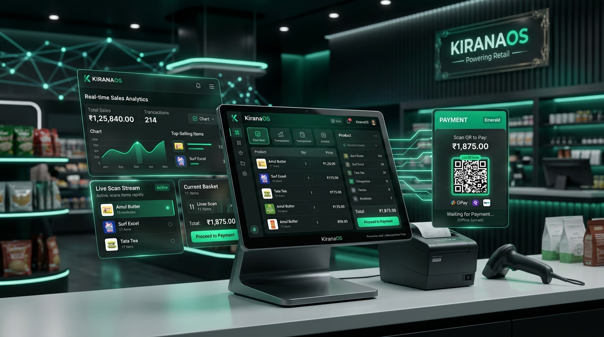

<div align="center">

# 🛒 KiranaOS — Offline-First Retail POS & ERP Operating System

[](https://flutter.dev)
[](https://dart.dev)
[](https://drift.simonbinder.eu)
[](https://supabase.com)
[](https://nextjs.org)
[](https://opensource.org/licenses/MIT)

<br/>



<br/>

**KiranaOS** is a production-grade, distributed, offline-first Point of Sale (POS) and Enterprise Resource Planning (ERP) platform architected specifically for Indian retail grocery, general provision stores (Kiranas), and mini-supermarkets.

</div>

---

## 📖 Executive Summary & Vision

Traditional retail in India is powered by over 13 million neighborhood Kirana stores driving 90% of the nation's $800B+ grocery commerce. During evening peak hours (6 PM – 9 PM), store cashiers have an operational window of **2 to 5 seconds per customer item**. 

Cloud-only POS software fails in Indian retail environments due to intermittent 4G/5G connectivity, power fluctuations, and basement dead zones. **KiranaOS** solves this with a **local-first, cloud-authoritative architecture**:

- ⚡ **Zero-Latency Billing**: Local SQLite (Drift ORM) delivers item lookups in `<15ms` and local bill finalization in `<50ms`.
- 🔌 **100% Offline-First**: Continue billing, printing, stock adjustments, and Udhaar recording indefinitely without internet.
- 🔄 **2-Way Automatic Sync**: Queues mutation operations with deterministic UUID v4 idempotency keys and synchronizes to Supabase PostgreSQL when connectivity resumes.
- 🪙 **Zero Floating-Point Error Arithmetic**: Pure integer Paise math (1 INR = 100 Paise) across all calculations prevents rounding discrepancies and GST calculation drift.
- 📒 **Digital Udhaar (Khata) & WhatsApp Recovery**: Customer credit limits, transaction histories, and 1-tap WhatsApp payment reminders with dynamic UPI QR codes.
- 📊 **Day-End Z-Report**: Automated reconciliation of physical cash drawer, digital payments, supplier payouts, and credit collections.

---

## 🏛️ System Architecture

KiranaOS utilizes a dual-tier distributed topology with pure separation of concerns across Mobile/Tablet terminals and the Web Back-Office.

```
┌────────────────────────────────────────────────────────┐       ┌───────────────────────────────────────────────────────┐
│              FLUTTER CLIENT (Mobile/Tablet)            │       │               NEXT.JS WEB (Desktop Portal)            │
│                                                        │       │                                                       │
│  Presentation (Riverpod 2.x + GoRouter 14.x)           │       │  React Server Components + Client Data Grids          │
│       │                                                │       │       │                                               │
│  Domain (Pure Dart Entities & Use Cases)               │       │  Domain Actions & Server Validations                  │
│       │                                                │       │       │                                               │
│  Data Layer (Repositories + Sync Engine)               │       │  Supabase PostgREST Client + Direct SSR queries       │
│       │                                      │         │       └──────────────────────────┬────────────────────────────┘
│  Local SQLite (Drift ORM)             Supabase SDK     │                                  │
│  (Zero-latency POS Operations)        (Cloud Sync)     │                                  │
└──────────────────────────────────────────────┬─────────┘                                  │
                                               │                                            │
                                               ▼                                            ▼
                                 ┌─────────────────────────────────────────────────────────────┐
                                 │                 SUPABASE CLOUD INFRASTRUCTURE               │
                                 │                                                             │
                                 │   • PostgreSQL 16 (Authoritative Database + RLS Policies)   │
                                 │   • GoTrue Auth (JWT + Phone OTP + PIN Verification)        │
                                 │   • Realtime Engine (Change Data Capture WebSockets)        │
                                 │   • Storage Buckets (Product WebP Images with Edge CDN)     │
                                 │   • Edge Functions (WhatsApp API, PDF Receipt Generation)   │
                                 └─────────────────────────────────────────────────────────────┘
```

---

## ✨ Key Capabilities & Feature Modules

KiranaOS comes equipped with 20 modular, Clean-Architecture features:

| Feature Module | Core Functionality & Technical Implementation |
| :--- | :--- |
| **⚡ High-Speed Billing** | Real-time cart calculations, physical barcode scanner support (USB/HID & Camera via Google MLKit), loose item weight calculator, multi-item discount rules, and park/hold bills. |
| **📦 Product Catalog** | Dual-barcode management (13-digit EAN/UPC & internal SKUs), custom units (kg, g, L, ml, pcs), category taxonomies, HSN codes, and WebP product asset caching. |
| **📒 Udhaar (Credit) Ledger** | Customer Khata tracking, risk credit limits, transaction statements, partial bill settlement, and 1-tap WhatsApp payment reminders with pre-filled UPI links. |
| **💳 Payments & UPI** | Cash drawer management, dynamic on-screen Bharat QR / UPI QR code generation, split payments (Cash + UPI + Credit), and instant thermal receipt printing (ESC/POS). |
| **📊 Inventory & Batches** | Real-time stock decrement on checkout, batch expiry date tracking, minimum safety stock thresholds, and stock inwarding adjustments. |
| **🚚 Purchases & Suppliers**| Supplier directory, purchase order inwarding, purchase price vs. selling MRP margin tracking, and supplier credit balance tracking. |
| **💸 Expense Tracker** | Petty cash outlays, store rent, electricity, transport, tea/snacks, and staff salary advances deducted from daily register totals. |
| **📈 Reports & Z-Report** | Day-End Z-Report cash reconciliation, Gross Margin analysis, Fast-moving vs. Dead stock tracking, and GST Sales/Inward summaries. |
| **👥 Multi-Staff RBAC** | Owner, Store Manager, and Cashier roles with granular permissions, secure PIN overrides for bill cancellations, and audit logs. |
| **🔄 Offline Sync Engine** | Offline mutation queue, exponential backoff retries, conflict resolution policies (LWW & Invariant checking), and connection state monitor. |

---

## 🗂️ Detailed Monorepo Directory & File Structure

```text
kirana-os/
├── .env                                       # Local Environment Secret Configuration (Supabase Keys, Database URLs)
├── .env.example                               # Environment Variable Template & Schema Documentation
├── .gitignore                                 # Monorepo Version Control Exclusions (Flutter, Node, Dart, OS)
├── README.md                                  # Primary Monorepo Architecture & Operational Blueprint
│
├── assets/                                    # Top-Level Visual Assets & Branding
│   ├── banner.png                             # High-Resolution (16:9) Visual Banner for Project Showcase
│   └── kirana_os_banner.jpg                   # Compressed Web & Distribution Banner
│
├── apps/                                      # Production Applications
│   ├── mobile/                                # Flutter Desktop/Tablet/Mobile POS Client Application
│   │   ├── .env / .env.example                # Mobile Environment Configurations (Supabase URL, Anon Key)
│   │   ├── analysis_options.yaml              # Strict Dart Linter Rules & Static Analysis Setup
│   │   ├── build.yaml                         # Drift ORM & Freezed Code Generation Configuration
│   │   ├── pubspec.yaml / pubspec.lock        # Flutter Dependencies (Riverpod, Drift, GoRouter, Supabase)
│   │   ├── android/                           # Android Native Host Project (Gradle Scripts, Manifest, Native Drivers)
│   │   ├── ios/                               # iOS Native Host Project (Xcode Workspace, CocoaPods, Entitlements)
│   │   ├── windows/                           # Windows Desktop Native Host (C++ Runner, CMake, Win32 Windowing)
│   │   ├── assets/                            # Mobile Client Branding Assets, App Icons, Audio Chimes
│   │   ├── lib/                               # Primary Dart Source Code
│   │   │   ├── main.dart                      # Application Entry Point (Riverpod ProviderScope & Services Bootstrapper)
│   │   │   ├── app/                           # App Bootstrapping & Router Architecture
│   │   │   │   ├── app.dart                   # Root Widget configuring Material 3 Theme & Global Router
│   │   │   │   ├── app_config.dart            # Environment Configuration & SLA Threshold Tokens
│   │   │   │   ├── app_providers.dart         # Core Dependency Injection Providers (Supabase, Drift, Storage)
│   │   │   │   └── router.dart                # GoRouter 14.x Declarative Routes with Auth & Onboarding Guards
│   │   │   │
│   │   │   ├── core/                          # Core Cross-Cutting Technical Infrastructure
│   │   │   │   ├── animation/                 # 60fps Micro-Animation Helpers, Fade/Slide/Scale Transitions
│   │   │   │   ├── errors/                    # Functional Result<T> Monad & Typed Failure Hierarchy
│   │   │   │   │   ├── failures.dart          # Base Failure Classes (ServerFailure, CacheFailure, SyncFailure)
│   │   │   │   │   └── result.dart            # Immutable Result.ok() and Result.fail() Functional Boundaries
│   │   │   │   ├── extensions/                # Dart & Flutter Helper Extensions
│   │   │   │   │   ├── context_extensions.dart# BuildContext Theme & MediaQuery Helpers
│   │   │   │   │   ├── num_extensions.dart    # Numeric Formatting & Currency Conversion Helpers
│   │   │   │   │   └── string_extensions.dart # Text Validation, Capitalization & Search Helpers
│   │   │   │   ├── network/                   # Network Resilience & Telemetry
│   │   │   │   │   ├── api_client.dart        # Supabase PostgREST & Edge Function Client Wrapper
│   │   │   │   │   ├── connectivity_service.dart# Real-time Internet & Socket Monitoring Service
│   │   │   │   │   └── connectivity_status.dart# Connectivity Enums (Online, Offline, Cellular)
│   │   │   │   ├── services/                  # Global Utility Services
│   │   │   │   │   └── pincode_service.dart   # Indian Pincode Validation & City/State Auto-fill Service
│   │   │   │   ├── storage/                   # Local Persistence Adapters
│   │   │   │   │   ├── preferences_service.dart# SharedPreferences Wrapper (UI Settings, Printer MACs)
│   │   │   │   │   ├── product_image_service.dart# Local WebP Product Image Caching & Compression Adapter
│   │   │   │   │   └── secure_storage_service.dart# Encrypted Keychain/Keystore Adapter for Auth Tokens & PINs
│   │   │   │   ├── sync/                      # Distributed 2-Way Offline Sync Engine
│   │   │   │   │   ├── conflict_resolver.dart # Conflict Strategies (Last-Write-Wins & Business Rules)
│   │   │   │   │   ├── sync_engine.dart       # Sync Pipeline Orchestrator (Queue Processor & Network Hooks)
│   │   │   │   │   └── sync_retry_policy.dart # Exponential Backoff & Jitter Retry Calculator
│   │   │   │   ├── theme/                     # Material 3 Design System Specification
│   │   │   │   │   ├── app_theme.dart         # Light & Dark ThemeData Builders
│   │   │   │   │   ├── colors.dart            # Kirana Emerald (#00897B) & Amber Gold (#FFB300) Palette
│   │   │   │   │   ├── component_theme.dart   # Buttons, Input Fields, Cards, and Dialog Themes
│   │   │   │   │   ├── radius.dart            # Border Radius System Tokens (4dp to 24dp)
│   │   │   │   │   ├── shadows.dart           # Elevation & Shadow Tokens
│   │   │   │   │   ├── spacing.dart           # Layout Spacing Tokens (4dp grid)
│   │   │   │   │   └── typography.dart        # Google Fonts (Outfit / Inter) Typography Scale
│   │   │   │   ├── utils/                     # Utility Classes
│   │   │   │   │   ├── app_logger.dart        # Structured Logging with Log Levels & File Output
│   │   │   │   │   ├── currency_formatter.dart# Zero-float Indian Rupee (₹) Formatter (Paise to INR)
│   │   │   │   │   ├── date_formatter.dart    # IST Timezone Date & Time Formatting Utilities
│   │   │   │   │   ├── debouncer.dart         # Search Input & Barcode Gun Input Debouncer
│   │   │   │   │   ├── id_generator.dart      # Idempotent UUID v4 Generator for Offline Mutations
│   │   │   │   │   └── tax_calculator.dart    # Pure Integer GST Decomposition (CGST, SGST, IGST)
│   │   │   │   └── widgets/                   # Reusable Primitive UI Widgets
│   │   │   │       ├── app_button.dart        # Primary, Secondary & Icon Button Components
│   │   │   │       ├── app_text_field.dart    # Styled Form Text Input Field
│   │   │   │       ├── connectivity_banner.dart# Offline State Banner Indicator
│   │   │   │       ├── empty_state.dart       # Illustrated Empty State Placeholder
│   │   │   │       ├── error_view.dart        # Standardized Error Display & Retry Component
│   │   │   │       ├── loading_skeleton.dart  # Shimmer Animation Skeleton Loader
│   │   │   │       └── responsive_layout.dart # Mobile/Tablet Grid Layout Adapter
│   │   │   │
│   │   │   ├── database/                      # Drift SQLite Local Database Layer
│   │   │   │   ├── converters/                # Type Converters
│   │   │   │   │   └── json_map_converter.dart# JSON String to Map<String, dynamic> Drift Converter
│   │   │   │   └── drift/                     # Drift ORM Implementation
│   │   │   │       ├── database.dart          # Local Database Class, Schema Migrations & Table Registry
│   │   │   │       ├── database.g.dart        # Generated Drift Database Code (build_runner)
│   │   │   │       ├── daos/                  # Data Access Objects (DAOs)
│   │   │   │       │   ├── billing_dao.dart   # Billing & Invoice Transaction Queries
│   │   │   │       │   ├── categories_dao.dart# Product Category Queries
│   │   │   │       │   ├── customers_dao.dart # Customer & Udhaar Ledger Queries
│   │   │   │       │   ├── products_dao.dart  # Sub-15ms Barcode & Product Lookups
│   │   │   │       │   └── sync_dao.dart      # Offline Mutation Queue Queries
│   │   │   │       └── tables/                # SQLite Schema Definitions
│   │   │   │           ├── bill_items_table.dart# Invoice Items & Tax Calculations
│   │   │   │           ├── bills_table.dart   # Invoice Master Table
│   │   │   │           ├── categories_table.dart# Category Taxonomies Table
│   │   │   │           ├── credit_transactions_table.dart# Customer Udhaar Ledgers
│   │   │   │           ├── customers_table.dart# Customer Profiles & Credit Limits
│   │   │   │           ├── inventory_movements_table.dart# Stock In/Out Audit Logs
│   │   │   │           ├── payments_table.dart# Payment Tender Records (Cash/UPI/Credit)
│   │   │   │           ├── product_barcodes_table.dart# EAN-13/UPC Dual Barcodes Mapping
│   │   │   │           ├── products_table.dart# Product Master Catalog Table
│   │   │   │           ├── shops_table.dart   # Shop Identity & Configuration Table
│   │   │   │           ├── sync_queue_table.dart# Offline Mutation Event Queue
│   │   │   │           └── user_profiles_table.dart# Staff Profiles & RBAC Roles
│   │   │   │
│   │   │   └── features/                      # Clean Architecture Modular Feature Domains
│   │   │       ├── auth/                      # Authentication & RBAC Management
│   │   │       │   ├── data/                  # Remote & Local Auth Datasources, Auth Repository
│   │   │       │   ├── domain/                # Auth State Models & Password/PIN Use Cases
│   │   │       │   └── presentation/          # Login, Register, PIN Override, Auth Screens & Providers
│   │   │       ├── barcode/                   # Barcode Gun & Camera Scanner Integration
│   │   │       │   └── presentation/          # MLKit Barcode Scanner Screen & Scan Result Bottom Sheet
│   │   │       ├── billing/                   # High-Speed POS Billing Engine
│   │   │       │   ├── data/                  # Billing Repositories & Local/Remote Datasources
│   │   │       │   ├── domain/                # Bill Models, Hold Bill Models, Payment Enums & Use Cases
│   │   │       │   └── presentation/          # Active POS Billing Screen, Parked Bills & Bill History Modal
│   │   │       ├── categories/                # Product Category Taxonomy Management
│   │   │       │   ├── data/                  # Category Datasources & Repository Implementations
│   │   │       │   ├── domain/                # Category Domain Models & Repositories
│   │   │       │   └── presentation/          # Category List Screen & Provider
│   │   │       ├── credit/                    # Udhaar (Khata) Customer Ledger
│   │   │       │   └── presentation/          # Customer Udhaar Balance & Repayment Screen
│   │   │       ├── customers/                 # Customer Relationship Management (CRM)
│   │   │       │   ├── data/                  # Customer Datasources & Repositories
│   │   │       │   ├── domain/                # Customer Repositories & Search Filters
│   │   │       │   └── presentation/          # Customer List Screen & Purchase History Viewer
│   │   │       ├── dashboard/                 # Daily Sales Metrics & Quick Actions
│   │   │       │   ├── data/                  # Dashboard Local Metrics Datasource & Repository
│   │   │       │   ├── domain/                # Dashboard Metrics Aggregate Domain Model
│   │   │       │   └── presentation/          # Live Dashboard Screen & Active Cashier Session Header
│   │   │       ├── expenses/                  # Petty Cash & Shop Expense Logging
│   │   │       │   └── presentation/          # Daily Store Expense Entry Screen
│   │   │       ├── inventory/                 # Inventory & Stock Level Control
│   │   │       │   ├── data/                  # Stock, Low-Stock & Movement Datasources & Repositories
│   │   │       │   ├── domain/                # Inventory Models, Stock Adjustment Requests & Alerts
│   │   │       │   └── presentation/          # Stock Overview Screen, Stock Adjustment Sheet & Low Stock Alerts
│   │   │       ├── invoices/                  # Digital Receipts & Invoice Viewing
│   │   │       │   └── presentation/          # Invoice History & Search Screen
│   │   │       ├── notifications/             # System Alert Queue
│   │   │       │   └── presentation/          # Low Stock & Payment Overdue Notification Screen
│   │   │       ├── onboarding/                # First-Time Merchant Wizard
│   │   │       │   └── presentation/          # Multi-Step Store Registration Screen
│   │   │       ├── payments/                  # Payment Processing & Bharat QR Engine
│   │   │       │   └── presentation/          # Dynamic UPI QR Code, Cash Tender & Split Payment Screen
│   │   │       ├── products/                  # Product Catalog & Loose Pricing Engine
│   │   │       │   ├── data/                  # Product Datasources & Repository Implementations
│   │   │       │   ├── domain/                # Master Product Models & Loose Pricing Interfaces
│   │   │       │   └── presentation/          # Product Catalog Screen, WebP Picker & Loose Item Weight Calculator
│   │   │       ├── profile/                   # Shop Profile & Identity Configuration
│   │   │       │   ├── data/                  # Profile Datasources & Repositories
│   │   │       │   ├── domain/                # Update Profile Use Cases & Interfaces
│   │   │       │   └── presentation/          # Shop Settings Screen & Profile Provider
│   │   │       ├── purchases/                 # Inward Stock & Supplier Purchase Orders
│   │   │       │   ├── data/                  # Purchase Order Datasources & Repositories
│   │   │       │   ├── domain/                # Purchase Models & Stock Inwarding Specifications
│   │   │       │   └── presentation/          # Purchase Draft Inwarding Screen & Item Search Sheet
│   │   │       ├── receipts/                  # ESC/POS Thermal Printing & PDF Services
│   │   │       │   ├── domain/                # Bluetooth/USB Printer Models, PDF Exporters & Receipt Formatters
│   │   │       │   └── presentation/          # Completed Receipt Action Screen, PDF Preview & Printer Selector
│   │   │       ├── reports/                   # Day-End Z-Report & Sales Analytics
│   │   │       │   └── presentation/          # Z-Report Reconciliation & Revenue Summary Screen
│   │   │       ├── returns/                   # Customer Bill Returns & Refunds
│   │   │       │   └── presentation/          # Bill Return Processing & Stock Re-entry Screen
│   │   │       ├── settings/                  # Hardware & App Configuration Dashboard
│   │   │       │   ├── data/                  # Shop Settings Local & Remote Datasources
│   │   │       │   ├── domain/                # Settings Models & Update Use Cases
│   │   │       │   └── presentation/          # Hardware Printer Setup, Barcode Config & Database Tools
│   │   │       ├── shop/                      # Shop Creation & Multi-Tenant Setup
│   │   │       │   ├── data/                  # Shop Local/Remote Datasources & Repositories
│   │   │       │   ├── domain/                # Shop Models & Create Shop Use Case
│   │   │       │   └── presentation/          # Shop Setup Screen & Shop Provider
│   │   │       ├── splash/                    # App Initialization Splash Screen
│   │   │       │   └── presentation/          # Session Verification & Boot Screen
│   │   │       ├── staff/                     # Multi-Staff RBAC Management
│   │   │       │   ├── data/                  # Staff Datasources & Repositories
│   │   │       │   ├── domain/                # Staff Models & RBAC Permission Use Cases
│   │   │       │   └── presentation/          # Staff Directory & PIN Assignment Screen
│   │   │       └── suppliers/                 # Supplier Directory & Vendor Ledgers
│   │   │           ├── data/                  # Supplier Datasources & Repositories
│   │   │           ├── domain/                # Supplier Domain Models & Ledger Interfaces
│   │   │           └── presentation/          # Vendor Profiles, Add/Edit Dialog & Supplier Selector
│   │   │
│   │   └── test/                              # Automated Test Suite (23 Sub-Suites)
│   │       ├── core_invariants_test.dart      # Standard Test Runner & Invariant Sanity Verification
│   │       ├── widget_test.dart               # Core Flutter Widget Rendering Tests
│   │       ├── auth/                          # Auth Security, PIN Hardening, Notifier & User Data Sync Tests
│   │       ├── barcodes/                      # Barcode Foundation, Notifier, Repository & MLKit Validation Tests
│   │       ├── billing/                       # Billing Engine, Cart Invariants, Customer Controls & Checkout Tests
│   │       ├── categories/                    # Category Notifier & Repository Tests
│   │       ├── dashboard/                     # Dashboard Metrics & Session Header Tests
│   │       ├── database/                      # Drift SQLite DAO & Migration Tests
│   │       ├── inventory/                     # Inventory Configurations, Adjustment, Overview & Low-Stock Alert Tests
│   │       ├── products/                      # Product Catalog Foundation, WebP Image & Product Notifier Tests
│   │       ├── profile/                       # Profile Management Tests
│   │       ├── purchases/                     # Purchase Inwarding Foundation & Purchase History Tests
│   │       ├── receipts/                      # PDF Receipt Export, Printer Configuration & Printing Tests
│   │       ├── repositories/                  # Product Repository Implementation Tests
│   │       ├── router/                        # GoRouter Auth & Onboarding Guard Tests
│   │       ├── security/                      # Multi-Tenant Isolation & RLS Invariant Tests
│   │       ├── services/                      # Pincode Lookup Service Unit Tests
│   │       ├── settings/                      # Business Settings & Tax/GST Foundation Tests
│   │       ├── shop/                          # Shop Onboarding, Branding & Setup Tests
│   │       ├── staff/                         # Multi-Staff RBAC Management Tests
│   │       ├── suppliers/                     # Supplier Ledger & Management Tests
│   │       └── sync/                          # Offline Sync Engine & Idempotent Retry Tests
│   │
│   └── web/                                   # Next.js 15 Web Portal & Back-Office Analytics
│       ├── .env.example / .env.local          # Web Portal Environment Configurations
│       ├── next-env.d.ts                      # Next.js TypeScript Environment Declaration
│       ├── package.json / package-lock.json   # Node Dependencies (Next 15, React 19, Supabase JS, Prisma)
│       ├── prisma.config.ts                   # Prisma Client & Connection Pool Configuration
│       ├── tailwind.config.ts                 # Tailwind CSS Color System Tokens & Component Utilities
│       ├── tsconfig.json                      # Strict TypeScript Compiler Options
│       ├── prisma/                            # Web Portal Database ORM
│       │   └── schema.prisma                  # Prisma Database Schema for PostgreSQL Query Generation
│       └── src/                               # Web Application Source
│           ├── middleware.ts                  # Supabase Session Authentication Middleware for App Router
│           ├── app/                           # Next.js 15 App Router Pages
│           │   ├── globals.css                # Global CSS Styles & Tailwind Directives
│           │   ├── layout.tsx                 # Root Layout Component with Inter/Outfit Fonts & Nav Bar
│           │   └── page.tsx                   # Master Web Analytics Dashboard Landing Page
│           ├── types/                         # Shared TypeScript Interfaces
│           │   └── index.ts                   # Core Data Contracts (Analytics, Inventory, Reports)
│           └── utils/                         # Web Utility Libraries
│               └── supabase/                  # Supabase SSR & Client Factory Helpers
│                   ├── client.ts              # Browser Client Instantiator for React Components
│                   ├── middleware.ts          # Edge Middleware Supabase Auth Token Refresh Helper
│                   └── server.ts              # Server Components & Server Actions Supabase Client
│
├── packages/                                  # Shared Workspace Packages
│   └── core_contracts/                        # Pure Dart Standard Library (Shared by Mobile & Services)
│       ├── pubspec.yaml / pubspec.lock        # Package Dependencies & SDK Version Rules
│       ├── lib/                               # Package Entry Point
│       │   ├── currency/                      # Integer Financial Calculations
│       │   │   └── money.dart                 # Pure Integer Paise Money Value Object (Zero-float math)
│       │   ├── sync/                          # Synchronization Protocols
│       │   │   └── sync_payload.dart          # Sync Payload Interfaces, Mutation Enums & Idempotency Keys
│       │   └── tax/                           # Indian Tax Computation Services
│       │       └── tax_calculator.dart        # Pure Integer CGST, SGST, IGST Decomposition Calculator
│       └── test/                              # Core Contracts Unit Tests
│           └── money_tax_test.dart            # Math Invariant & Currency Formatting Unit Tests
│
├── supabase/                                  # Supabase Cloud Backend Infrastructure
│   ├── seed.sql                               # Seed Script for Dev Environments (Sample Shops, Products, Users)
│   └── migrations/                            # 25 Sequential PostgreSQL Database Migration Scripts
│       ├── 001_initial_schema.sql             # Base Tables (Shops, Profiles, Products, Bills, Sync Queue)
│       ├── 002_indexes_and_constraints.sql    # Foreign Keys, Composite Unique Keys, B-Tree Performance Indexes
│       ├── 003_rls_security_policies.sql      # Row Level Security (RLS) Policies enforcing shop_id isolation
│       ├── 004_rpc_functions.sql              # Stored Procedures for Atomic Checkout & Stock Inwarding
│       ├── 005_storage_and_media.sql          # Supabase Storage Bucket Policies for WebP Product Assets
│       ├── 006_shop_creation_rpc.sql          # Atomic Shop Provisioning & Owner Assignment Stored Procedure
│       ├── 007_categories_enhancement.sql     # Category Taxonomies & Parent-Child Subcategories
│       ├── 008_products_enhancement.sql       # Product HSN Codes, GST Slabs & Custom Selling Units
│       ├── 009_barcodes_enhancement.sql       # Dual Barcode (EAN-13 / UPC / Custom SKU) Mapping Table
│       ├── 010_inventory_stock_rpc.sql        # Inventory Decrement & Stock Audit Stored Procedures
│       ├── 011_confirm_purchase_stock_in_rpc.sql# Purchase Order Inwarding & Stock Increment Stored Procedure
│       ├── 012_supplier_management_schema.sql # Vendor Profiles, Supplier Balances & Purchase Ledgers
│       ├── 013_purchase_history_indexes.sql   # Fast Query Indexes on Purchase Orders & Supplier Records
│       ├── 014_stock_overview_indexes.sql     # Low Stock & Inventory Valuation Performance Indexes
│       ├── 015_low_stock_alerts_schema.sql    # Automatic Low Stock Alert Queue & Threshold Trigger Rules
│       ├── 016_stock_adjustment_rpc.sql       # Manual Stock Adjustment Stored Procedure (Spoilage/Shrinkage)
│       ├── 017_auth_profiles_and_recovery.sql # User Profile Schema, Staff PIN Hash & Auth Recovery Triggers
│       ├── 018_shop_onboarding_idempotency.sql# Idempotency Key Validation for Shop Provisioning
│       ├── 019_shop_branding_and_storage.sql  # Store Branding (Logo URL, Thermal Receipt Headers/Footers)
│       ├── 020_business_settings_schema.sql   # Store Settings (Inclusive/Exclusive Tax, Default Payment Rules)
│       ├── 021_tax_gst_foundation.sql         # GST Slab Matrix (0%, 5%, 12%, 18%, 28%) & Tax Component Tables
│       ├── 022_customer_foundation_schema.sql # Customer Khata Schema, Credit Limit Rules & Spend Metrics
│       ├── 023_payment_foundation_schema.sql  # Split Payment Tenders (Cash, UPI QR, Udhaar) & Cash Drawer Ledger
│       ├── 024_product_catalog_foundation_schema.sql# Loose Product Pricing & Quick Sell Catalog Tables
│       └── 025_discount_foundation_schema.sql # Flat/Percentage Item Discounts & Bill Level Promo Rules
│
└── docs/                                      # Complete Architectural & Engineering Specifications
    ├── PRD.md                                 # Product Requirements Document (User Personas & Feature Matrix)
    ├── TRD.md                                 # Technical Requirements Document (SLAs, Hardware & Tech Stack Specs)
    ├── ARCHITECTURE.md                        # Clean Architecture Specifications & Layer Dependencies
    ├── DATABASE.md                            # Database Design Specifications (PostgreSQL Cloud & SQLite Drift)
    ├── WORKFLOWS.md                           # Sequence Diagrams for POS Checkout, Udhaar & Z-Reports
    ├── OFFLINE_SYNC.md                        # 2-Way Sync Protocol, Conflict Resolution & Idempotency Rules
    ├── SECURITY.md                            # RLS Security Policies, Auth Guards & Multi-Staff RBAC Rules
    ├── ERROR_HANDLING.md                      # Functional Result<T> Monad & Typed Failure Specifications
    ├── DESIGN_SYSTEM.md                       # Material 3 Design Tokens (Colors, Typography, Spacing, Radius)
    ├── ANIMATION_SYSTEM.md                    # 60fps Micro-Animation & Purposeful Motion Guidelines
    ├── TESTING.md                             # Test Strategy Pyramid, DAO Test Specs & Mocking Standards
    ├── DEPLOYMENT.md                          # CI/CD Release Pipelines for Android (APK/AAB), Desktop & Web
    ├── NAVIGATION.md                          # Mobile Application Route Map & Navigation Tree
    ├── PHASE_02.md                            # Phase 02 Execution Roadmap & Architecture Audit
    ├── PHASE_02_PLAN.md                       # Step-by-Step Feature Implementation Action Plan
    ├── PHASE_03.md                            # Phase 03 Scaling & Analytics Operational Plan
    ├── PHASE_04_1.md                          # Phase 04 Part 1 Multi-Store Expansion Strategy
    └── PHASE_04_2.md                          # Phase 04 Part 2 Enterprise Hardware Integration Plan
```

---

## 🏛️ Comprehensive Monorepo Component Breakdown

### 1. POS & Terminal Mobile Client (`apps/mobile`)
Built using **Flutter 3.24+** and **Dart 3.5+**, the mobile application serves as the primary terminal in retail environments.
* **Architecture**: Clean Architecture with Riverpod 2.x for state management and GoRouter 14.x for declarative routing.
* **Database**: Local SQLite managed via **Drift ORM** ensuring sub-15ms barcode lookups and zero-network bill creation.
* **Clean Architecture Layers**:
  * `core/`: Global cross-cutting infrastructure including integer currency formatters, design tokens, error models, and offline synchronization engines.
  * `database/`: Native SQLite tables, DAOs, type converters, and migration scripts.
  * `features/`: 24 self-contained domain modules containing data sources, repositories, domain models, use cases, state providers, screens, and custom widgets.

### 2. Back-Office Web Portal (`apps/web`)
Built with **Next.js 15 (App Router)**, **React 19**, **Prisma ORM**, and **Tailwind CSS**.
* **Purpose**: Serves store owners with centralized inventory management, supplier ordering, back-office financial analytics, and store configuration.
* **Database Access**: Direct postgREST connection to Supabase PostgreSQL via `@supabase/ssr` with Prisma ORM support for complex analytical queries.

### 3. Core Financial Contracts Package (`packages/core_contracts`)
A zero-dependency pure Dart package shared across mobile and background tools.
* `Money`: Encapsulates zero-floating-point financial calculations where 1 INR = 100 Paise.
* `TaxCalculator`: Implements Indian GST logic for CGST, SGST, and IGST decomposition.
* `SyncPayload`: Defines contract interfaces and idempotency key types for offline-to-cloud change data capture.

### 4. Supabase Cloud Infrastructure (`supabase`)
* `migrations/`: 25 SQL files provisioning PostgreSQL 16 schemas, B-tree indexes, RLS policies, and stored procedures (RPCs).
* `seed.sql`: Automated developer seed script provisioning mock retail catalog items, categories, and test user credentials.

### 5. Architectural & Technical Documentation (`docs`)
An exhaustive 18-document blueprint detailing product requirements, database schemas, synchronization rules, hardware interfaces, design tokens, and CI/CD pipelines.

---

---

## ⚡ Core Engineering Principles

### 1. Zero Floating-Point Arithmetic Invariant
In retail billing with percentage discounts, fractional weights (e.g. 350 grams of Basmati rice), and GST slabs (0%, 5%, 12%, 18%, 28%), standard IEEE 754 floating-point math creates cumulative rounding errors.

All financial amounts in KiranaOS are strictly represented as **Integer Paise (`BIGINT` / `int`)**:
```dart
// 1 INR = 100 Paise
final priceInPaise = 1050; // Represents ₹10.50
final totalBillPaise = 125075; // Represents ₹1,250.75

// Formatting is deferred strictly to the presentation boundary:
final formatted = IndianRupeeFormatter.format(totalBillPaise); // "₹1,250.75"
```

### 2. Functional Error Handling (`Result<T>`)
KiranaOS bans untyped runtime exceptions across business layers. All repository and domain use cases return an immutable `Result<T>`:

```dart
Future<Result<Invoice>> finalizeBill(Cart cart) async {
  try {
    final invoice = await _billingRepository.createInvoice(cart);
    return Result.ok(invoice);
  } on LocalDatabaseException catch (e) {
    return Result.fail(DatabaseFailure(e.message));
  }
}
```

### 3. Sub-15ms Barcode Search Guarantee
SQLite indexes on `product_barcodes(barcode)` and `products(name)` allow instant item resolution before the cashier's barcode gun completes its return keystroke:
```sql
CREATE INDEX idx_product_barcodes_lookup ON product_barcodes (barcode);
CREATE INDEX idx_products_search ON products (name COLLATE NOCASE);
```

---

## 🚀 Quickstart & Development Setup

### Prerequisites
- **Flutter SDK**: `>= 3.24.0` ([Install Guide](https://docs.flutter.dev/get-started/install))
- **Dart SDK**: `>= 3.5.0`
- **Node.js**: `>= 20.0.0` & `npm` / `pnpm`
- **Supabase CLI**: (Optional, for local cloud stack)

### 1. Mobile POS Application (Flutter)

```bash
# Navigate to the mobile app directory
cd apps/mobile

# Install all Flutter and Dart dependencies
flutter pub get

# Generate Drift ORM code, DAOs, and Freezed models
dart run build_runner build --delete-conflicting-outputs

# Verify static code health (Zero Warnings Guarantee)
flutter analyze

# Run unit and widget test suites
flutter test

# Launch on connected Android device or desktop terminal
flutter run
```

### 2. Pure-Dart Core Contracts (`packages/core_contracts`)

```bash
cd packages/core_contracts

# Fetch dependencies
dart pub get

# Execute invariant financial & GST test suites
dart test
```

### 3. Web Back-Office & Analytics (`apps/web`)

```bash
cd apps/web

# Install dependencies
npm install

# Start local Next.js development server
npm run dev
```
Open [http://localhost:3000](http://localhost:3000) to view the web management dashboard.

---

## 📊 Performance Service Level Agreements (SLAs)

| Operational Metric | Target SLA | Engineering Implementation |
| :--- | :--- | :--- |
| **Local Barcode Lookup** | `< 15ms` | Indexed Drift SQLite queries with memory caching. |
| **Cart Item Render Latency** | `< 30ms` (60fps) | Unidirectional Riverpod state stream + micro-transitions `<=150ms`. |
| **Bill Finalization Latency** | `< 50ms` | Local SQLite ACID transaction; zero network blocking. |
| **Cold Startup Time** | `< 1.2s` | Deferred background synchronization warmup. |
| **Android Memory Ceiling** | `< 120MB RSS` | WebP image memory caching & object recycling. |
| **Crash-Free Sessions** | `> 99.95%` | Functional `Result<T>` boundaries with zero uncaught async errors. |

---

## 🎨 Design System & Visual Identity

KiranaOS is built on **Material 3** principles customized with an Indian retail-focused color palette engineered for high visibility under fluorescent shop lights:

- **Kirana Emerald** (`#00897B` / `#004D40`): Primary brand color representing financial prosperity and trust.
- **Amber Gold** (`#FFB300` / `#FF8F00`): Secondary accent for promotions, alerts, and pending sync badges.
- **High-Contrast Surface** (`#121212` / `#FFFFFF`): Crisp typography and generous touch targets (`min 48dp x 48dp`) for speed.

---

## 📚 Complete Engineering Documentation

Exhaustive technical documentation is available in the [`docs/`](docs/) directory:

- 📄 [Product Requirements Document (PRD)](docs/PRD.md)
- 📄 [Technical Requirements Document (TRD)](docs/TRD.md)
- 📄 [Clean Architecture & Feature Design](docs/ARCHITECTURE.md)
- 📄 [PostgreSQL & SQLite Database Specifications](docs/DATABASE.md)
- 📄 [POS Billing, Udhaar & Z-Report Workflows](docs/WORKFLOWS.md)
- 📄 [Offline Synchronization & Conflict Resolution](docs/OFFLINE_SYNC.md)
- 📄 [Security, Row Level Security & RBAC](docs/SECURITY.md)
- 📄 [Functional Error Handling Guidelines](docs/ERROR_HANDLING.md)
- 📄 [Design System Tokens & Typography](docs/DESIGN_SYSTEM.md)
- 📄 [Animation & Micro-Interaction Guidelines](docs/ANIMATION_SYSTEM.md)
- 📄 [Testing Pyramid & Quality Assurance](docs/TESTING.md)
- 📄 [CI/CD & Deployment Procedures](docs/DEPLOYMENT.md)
- 📄 [Phase 02 Actionable Roadmap](docs/PHASE_02_PLAN.md)

---

## 📄 License

This project is licensed under the MIT License — see the [LICENSE](LICENSE) file for details.
