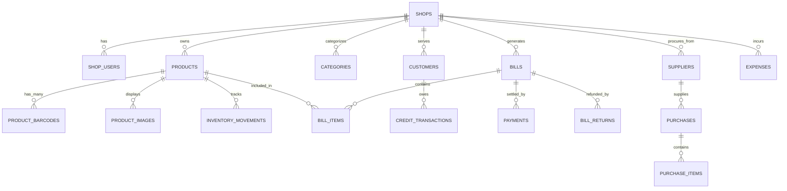

# Database Architecture & Entity Specification — KiranaOS

**Document Version**: 1.0.0 (Phase 01 Production Architecture)  
**Cloud Engine**: PostgreSQL 16 (Supabase)  
**Local Engine**: SQLite 3.45+ (Drift ORM in Flutter)  

---

## 1. Cloud PostgreSQL Entity-Relationship Schema

All financial values are stored in **Paise (BIGINT)**. All timestamps are **TIMESTAMPTZ in UTC**.



---

## 2. Table Specifications (Cloud PostgreSQL)

### 2.1 Multi-Tenant Core & Access Control

```sql
-- 1. SHOPS (Tenant Root)
CREATE TABLE shops (
    id UUID PRIMARY KEY DEFAULT gen_random_uuid(),
    name VARCHAR(255) NOT NULL,
    owner_id UUID NOT NULL REFERENCES auth.users(id) ON DELETE RESTRICT,
    phone VARCHAR(20) NOT NULL,
    email VARCHAR(255),
    gstin VARCHAR(15),
    fssai_license VARCHAR(14),
    address TEXT,
    city VARCHAR(100),
    state VARCHAR(100) NOT NULL DEFAULT 'Karnataka',
    pincode VARCHAR(10),
    upi_id VARCHAR(100),
    currency VARCHAR(10) NOT NULL DEFAULT 'INR',
    created_at TIMESTAMPTZ NOT NULL DEFAULT NOW(),
    updated_at TIMESTAMPTZ NOT NULL DEFAULT NOW(),
    is_active BOOLEAN NOT NULL DEFAULT TRUE
);
CREATE INDEX idx_shops_owner ON shops(owner_id);

-- 2. SHOP_USERS (RBAC Memberships)
CREATE TYPE user_role AS ENUM ('owner', 'manager', 'cashier');

CREATE TABLE shop_users (
    id UUID PRIMARY KEY DEFAULT gen_random_uuid(),
    shop_id UUID NOT NULL REFERENCES shops(id) ON DELETE CASCADE,
    user_id UUID NOT NULL REFERENCES auth.users(id) ON DELETE CASCADE,
    role user_role NOT NULL DEFAULT 'cashier',
    display_name VARCHAR(100) NOT NULL,
    pin_hash VARCHAR(255), -- 4-6 digit local quick login PIN
    created_at TIMESTAMPTZ NOT NULL DEFAULT NOW(),
    updated_at TIMESTAMPTZ NOT NULL DEFAULT NOW(),
    UNIQUE(shop_id, user_id)
);
CREATE INDEX idx_shop_users_lookup ON shop_users(shop_id, user_id);
```

### 2.2 Master Catalog, Pricing & Barcodes

```sql
-- 3. CATEGORIES
CREATE TABLE categories (
    id UUID PRIMARY KEY DEFAULT gen_random_uuid(),
    shop_id UUID NOT NULL REFERENCES shops(id) ON DELETE CASCADE,
    name VARCHAR(100) NOT NULL,
    parent_id UUID REFERENCES categories(id) ON DELETE SET NULL,
    icon_url TEXT,
    sort_order INT NOT NULL DEFAULT 0,
    created_at TIMESTAMPTZ NOT NULL DEFAULT NOW(),
    updated_at TIMESTAMPTZ NOT NULL DEFAULT NOW(),
    UNIQUE(shop_id, name)
);

-- 4. UNITS (e.g. piece, kg, g, l, ml, packet)
CREATE TABLE units (
    id UUID PRIMARY KEY DEFAULT gen_random_uuid(),
    shop_id UUID NOT NULL REFERENCES shops(id) ON DELETE CASCADE,
    name VARCHAR(50) NOT NULL,
    short_code VARCHAR(10) NOT NULL,
    is_fractional BOOLEAN NOT NULL DEFAULT FALSE, -- TRUE for kg/grams, FALSE for pcs
    created_at TIMESTAMPTZ NOT NULL DEFAULT NOW()
);

-- 5. PRODUCTS
CREATE TABLE products (
    id UUID PRIMARY KEY DEFAULT gen_random_uuid(),
    shop_id UUID NOT NULL REFERENCES shops(id) ON DELETE CASCADE,
    category_id UUID REFERENCES categories(id) ON DELETE SET NULL,
    unit_id UUID REFERENCES units(id) ON DELETE RESTRICT,
    name VARCHAR(255) NOT NULL,
    regional_name VARCHAR(255), -- Hindi, Kannada, Tamil, Telugu, etc.
    description TEXT,
    hsn_code VARCHAR(10),
    mrp_paise BIGINT NOT NULL, -- Maximum Retail Price
    selling_price_paise BIGINT NOT NULL, -- Actual selling price
    purchase_price_paise BIGINT NOT NULL DEFAULT 0, -- Cost of goods
    tax_rate_percentage NUMERIC(5, 2) NOT NULL DEFAULT 0.00, -- GST: 0, 5, 12, 18, 28
    is_tax_inclusive BOOLEAN NOT NULL DEFAULT TRUE,
    current_stock NUMERIC(12, 3) NOT NULL DEFAULT 0.000,
    min_stock_alert NUMERIC(12, 3) NOT NULL DEFAULT 5.000,
    is_loose BOOLEAN NOT NULL DEFAULT FALSE, -- Loose grain vs packaged
    is_active BOOLEAN NOT NULL DEFAULT TRUE,
    created_at TIMESTAMPTZ NOT NULL DEFAULT NOW(),
    updated_at TIMESTAMPTZ NOT NULL DEFAULT NOW()
);
CREATE INDEX idx_products_shop_active ON products(shop_id, is_active);
CREATE INDEX idx_products_name_trgm ON products USING gin(name gin_trgm_ops);

-- 6. PRODUCT_BARCODES (Supports multiple barcodes for one product SKU)
CREATE TABLE product_barcodes (
    id UUID PRIMARY KEY DEFAULT gen_random_uuid(),
    shop_id UUID NOT NULL REFERENCES shops(id) ON DELETE CASCADE,
    product_id UUID NOT NULL REFERENCES products(id) ON DELETE CASCADE,
    barcode VARCHAR(64) NOT NULL,
    is_primary BOOLEAN NOT NULL DEFAULT TRUE,
    created_at TIMESTAMPTZ NOT NULL DEFAULT NOW(),
    UNIQUE(shop_id, barcode)
);
CREATE INDEX idx_product_barcodes_lookup ON product_barcodes(shop_id, barcode);

-- 7. PRODUCT_IMAGES
CREATE TABLE product_images (
    id UUID PRIMARY KEY DEFAULT gen_random_uuid(),
    product_id UUID NOT NULL REFERENCES products(id) ON DELETE CASCADE,
    storage_path TEXT NOT NULL,
    public_url TEXT NOT NULL,
    is_primary BOOLEAN NOT NULL DEFAULT FALSE,
    created_at TIMESTAMPTZ NOT NULL DEFAULT NOW()
);
```

### 2.3 Inventory & Stock Audit Ledger

```sql
-- 8. INVENTORY_MOVEMENTS (Immutable double-entry stock audit)
CREATE TYPE movement_reason AS ENUM (
    'sale', 'sale_return', 'purchase_inward', 'purchase_return', 'stock_adjustment', 'spoilage_damage'
);

CREATE TABLE inventory_movements (
    id UUID PRIMARY KEY DEFAULT gen_random_uuid(),
    shop_id UUID NOT NULL REFERENCES shops(id) ON DELETE CASCADE,
    product_id UUID NOT NULL REFERENCES products(id) ON DELETE RESTRICT,
    quantity_delta NUMERIC(12, 3) NOT NULL, -- Negative for sales, positive for inward
    balance_after NUMERIC(12, 3) NOT NULL,
    reason movement_reason NOT NULL,
    reference_id UUID, -- Links to bill_id or purchase_id
    performed_by UUID NOT NULL REFERENCES auth.users(id),
    created_at TIMESTAMPTZ NOT NULL DEFAULT NOW()
);
CREATE INDEX idx_inventory_movements_audit ON inventory_movements(shop_id, product_id, created_at DESC);
```

### 2.4 Customers & Khata / Udhaar Subsystem

```sql
-- 9. CUSTOMERS
CREATE TABLE customers (
    id UUID PRIMARY KEY DEFAULT gen_random_uuid(),
    shop_id UUID NOT NULL REFERENCES shops(id) ON DELETE CASCADE,
    name VARCHAR(150) NOT NULL,
    phone VARCHAR(20) NOT NULL,
    address TEXT,
    credit_limit_paise BIGINT NOT NULL DEFAULT 500000, -- ₹5,000 default limit
    current_debt_paise BIGINT NOT NULL DEFAULT 0, -- Outstanding balance
    created_at TIMESTAMPTZ NOT NULL DEFAULT NOW(),
    updated_at TIMESTAMPTZ NOT NULL DEFAULT NOW(),
    UNIQUE(shop_id, phone)
);
CREATE INDEX idx_customers_phone ON customers(shop_id, phone);

-- 10. CREDIT_TRANSACTIONS (Udhaar Ledger)
CREATE TYPE credit_txn_type AS ENUM ('credit_given', 'payment_received', 'bad_debt_writeoff');

CREATE TABLE credit_transactions (
    id UUID PRIMARY KEY DEFAULT gen_random_uuid(),
    shop_id UUID NOT NULL REFERENCES shops(id) ON DELETE CASCADE,
    customer_id UUID NOT NULL REFERENCES customers(id) ON DELETE RESTRICT,
    bill_id UUID, -- Optional link to original bill
    amount_paise BIGINT NOT NULL,
    type credit_txn_type NOT NULL,
    notes TEXT,
    recorded_by UUID NOT NULL REFERENCES auth.users(id),
    created_at TIMESTAMPTZ NOT NULL DEFAULT NOW()
);
CREATE INDEX idx_credit_customer_history ON credit_transactions(customer_id, created_at DESC);
```

### 2.5 POS Billing, Invoices & Payments

```sql
-- 11. BILLS (Sales Invoices)
CREATE TABLE bills (
    id UUID PRIMARY KEY DEFAULT gen_random_uuid(),
    shop_id UUID NOT NULL REFERENCES shops(id) ON DELETE CASCADE,
    bill_number VARCHAR(50) NOT NULL, -- e.g. INV-202608-0001
    customer_id UUID REFERENCES customers(id) ON DELETE SET NULL,
    cashier_id UUID NOT NULL REFERENCES auth.users(id),
    subtotal_paise BIGINT NOT NULL,
    tax_total_paise BIGINT NOT NULL DEFAULT 0,
    discount_paise BIGINT NOT NULL DEFAULT 0,
    total_paise BIGINT NOT NULL,
    payment_status VARCHAR(20) NOT NULL DEFAULT 'paid', -- 'paid', 'partial', 'unpaid_credit'
    is_cancelled BOOLEAN NOT NULL DEFAULT FALSE,
    cancellation_reason TEXT,
    created_at TIMESTAMPTZ NOT NULL DEFAULT NOW(),
    updated_at TIMESTAMPTZ NOT NULL DEFAULT NOW(),
    UNIQUE(shop_id, bill_number)
);
CREATE INDEX idx_bills_shop_created ON bills(shop_id, created_at DESC);

-- 12. BILL_ITEMS
CREATE TABLE bill_items (
    id UUID PRIMARY KEY DEFAULT gen_random_uuid(),
    bill_id UUID NOT NULL REFERENCES bills(id) ON DELETE CASCADE,
    product_id UUID NOT NULL REFERENCES products(id) ON DELETE RESTRICT,
    product_name VARCHAR(255) NOT NULL,
    quantity NUMERIC(12, 3) NOT NULL,
    unit_price_paise BIGINT NOT NULL,
    tax_rate NUMERIC(5, 2) NOT NULL DEFAULT 0.00,
    tax_amount_paise BIGINT NOT NULL DEFAULT 0,
    total_paise BIGINT NOT NULL,
    created_at TIMESTAMPTZ NOT NULL DEFAULT NOW()
);
CREATE INDEX idx_bill_items_bill ON bill_items(bill_id);

-- 13. PAYMENTS
CREATE TYPE payment_mode AS ENUM ('cash', 'upi_qr', 'credit_khata', 'card', 'split');

CREATE TABLE payments (
    id UUID PRIMARY KEY DEFAULT gen_random_uuid(),
    shop_id UUID NOT NULL REFERENCES shops(id) ON DELETE CASCADE,
    bill_id UUID NOT NULL REFERENCES bills(id) ON DELETE CASCADE,
    mode payment_mode NOT NULL,
    amount_paise BIGINT NOT NULL,
    reference_number VARCHAR(100), -- UPI UTR or Card auth code
    created_at TIMESTAMPTZ NOT NULL DEFAULT NOW()
);
```

### 2.6 Sync Queue & Conflict Invariants

```sql
-- 14. SYNC_OPERATIONS (Server Ingestion & Audit Tracking)
CREATE TABLE sync_operations (
    operation_id UUID PRIMARY KEY, -- Client-generated UUID for idempotency
    shop_id UUID NOT NULL REFERENCES shops(id) ON DELETE CASCADE,
    entity_type VARCHAR(50) NOT NULL,
    operation_type VARCHAR(20) NOT NULL, -- 'INSERT', 'UPDATE', 'DELETE'
    client_timestamp TIMESTAMPTZ NOT NULL,
    server_timestamp TIMESTAMPTZ NOT NULL DEFAULT NOW(),
    payload JSONB NOT NULL,
    processed_status VARCHAR(20) NOT NULL DEFAULT 'SUCCESS'
);
CREATE INDEX idx_sync_shop_audit ON sync_operations(shop_id, server_timestamp DESC);
```

---

## 3. Row-Level Security (RLS) Policy Specifications

Every table enforces PostgreSQL RLS based on tenant membership:

```sql
-- Enable RLS across all tables
ALTER TABLE shops ENABLE ROW LEVEL SECURITY;
ALTER TABLE shop_users ENABLE ROW LEVEL SECURITY;
ALTER TABLE products ENABLE ROW LEVEL SECURITY;
ALTER TABLE product_barcodes ENABLE ROW LEVEL SECURITY;
ALTER TABLE categories ENABLE ROW LEVEL SECURITY;
ALTER TABLE customers ENABLE ROW LEVEL SECURITY;
ALTER TABLE bills ENABLE ROW LEVEL SECURITY;
ALTER TABLE bill_items ENABLE ROW LEVEL SECURITY;
ALTER TABLE payments ENABLE ROW LEVEL SECURITY;
ALTER TABLE credit_transactions ENABLE ROW LEVEL SECURITY;
ALTER TABLE inventory_movements ENABLE ROW LEVEL SECURITY;

-- Helper Function: Get current authenticated user's shop_ids
CREATE OR REPLACE FUNCTION get_user_shop_ids()
RETURNS SETOF UUID AS $$
    SELECT shop_id FROM shop_users WHERE user_id = auth.uid();
$$ LANGUAGE sql SECURITY DEFINER STABLE;

-- Generic Shop Tenant Isolation Policy (Applied to each shop-owned table)
CREATE POLICY shop_tenant_isolation_policy ON products
FOR ALL
USING (shop_id IN (SELECT get_user_shop_ids()))
WITH CHECK (shop_id IN (SELECT get_user_shop_ids()));
```

---

## 4. Drift SQLite Schema Mapping (Mobile Local DB)

In Flutter, the local Drift SQLite database mirrors these structures in `lib/database/drift/tables/`:

1. `ShopsTable` -> `shops`
2. `ProductsTable` -> `products`
3. `ProductBarcodesTable` -> `product_barcodes`
4. `CategoriesTable` -> `categories`
5. `CustomersTable` -> `customers`
6. `BillsTable` -> `bills`
7. `BillItemsTable` -> `bill_items`
8. `PaymentsTable` -> `payments`
9. `CreditTransactionsTable` -> `credit_transactions`
10. `InventoryMovementsTable` -> `inventory_movements`
11. `SyncQueueTable` -> `sync_queue` (Local pending outbound buffer)
