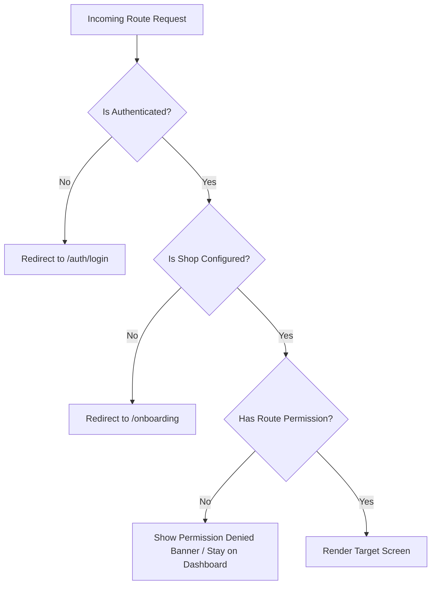

# Navigation Architecture & Routing Specification — KiranaOS

**Document Version**: 1.0.0 (Phase 01 Production Architecture)  
**Router Engine**: GoRouter 14.x (Flutter Declarative Navigation)  

---

## 1. Route Hierarchy & URI Structure

```
/ (Root Redirect -> /dashboard or /auth)
│
├── /auth
│   ├── /login                     # Phone / OTP Login
│   ├── /verify-otp               # SMS Verification
│   └── /pin-entry                 # Fast Cashier Quick PIN Unlock
│
├── /onboarding                   # First-Time Shop Wizard
│
└── /app (Authenticated Shell Route with Adaptive Nav)
    │
    ├── /dashboard                # Overview KPIs & Quick Actions
    │
    ├── /billing                  # Core POS Terminal (Cart & Checkout)
    │   ├── /quick-add            # Manual item adder modal
    │   └── /payment-modal        # Cash/UPI/Khata settlement dialog
    │
    ├── /barcode                  # Hardware & Camera Scanner Bridge
    │
    ├── /products                 # Catalog Grid / List
    │   ├── /create               # New SKU creation sheet
    │   └── /:id                  # Product details & barcode editor
    │
    ├── /categories               # Category Taxonomy Manager
    │
    ├── /inventory                # Stock Management & Low-Stock Alerts
    │   └── /adjust               # Manual stock adjustment sheet
    │
    ├── /purchases                # Inward Supplier Purchases
    │   ├── /create               # New PO / Inward Bill
    │   └── /:id                  # Purchase Bill Details
    │
    ├── /suppliers                # Supplier Ledger
    │   └── /:id                  # Supplier Transaction History
    │
    ├── /customers                # Customer Directory
    │   └── /:id                  # Customer Khata & Transaction History
    │
    ├── /credit                   # Udhaar (Khata) Dashboard
    │   └── /settle               # Credit Payment Collection Modal
    │
    ├── /bills                    # Sales History & Invoice List
    │   └── /:id                  # Invoice View / Thermal Print / WhatsApp
    │
    ├── /returns                  # Return & Refund Management
    │   └── /create               # Process Item Return
    │
    ├── /expenses                 # Daily Store Expense Ledger
    │   └── /create               # Log Expense Sheet
    │
    ├── /reports                  # Business Analytics & Z-Report
    │   ├── /day-end              # Daily Cash Drawer Close
    │   ├── /sales                # Sales breakdown
    │   └── /gst                  # GSTR-1 Tax Summary
    │
    ├── /notifications            # Alert Center (Stock, Sync, Debt)
    │
    ├── /profile                  # Shop Info, GSTIN, FSSAI, UPI Settings
    │
    └── /settings                 # Device Setup (Printers, Scanners, Sync)
```

---

## 2. Route Guards & Access Control Matrix

GoRouter's `redirect` callback intercepts all route changes based on `AuthState` and `UserRole`:



### Role-Based Access Matrix

| Route Group | Cashier | Store Manager | Shop Owner |
| :--- | :---: | :---: | :---: |
| `/billing`, `/barcode` | ✅ Allowed | ✅ Allowed | ✅ Allowed |
| `/bills`, `/invoices` | ✅ Allowed (View) | ✅ Allowed | ✅ Allowed |
| `/bills/:id/cancel` | ❌ PIN Required | ✅ Allowed | ✅ Allowed |
| `/customers`, `/credit` | ✅ Record Only | ✅ Full Access | ✅ Full Access |
| `/products`, `/inventory` | 👁️ View Only | ✅ Full Access | ✅ Full Access |
| `/purchases`, `/suppliers`| ❌ Denied | ✅ Full Access | ✅ Full Access |
| `/expenses` | ✅ Log Only | ✅ Full Access | ✅ Full Access |
| `/reports` (Profit/GST) | ❌ Denied | 👁️ View Sales | ✅ Full Access |
| `/settings` (Hardware) | ✅ View/Pair | ✅ Full Access | ✅ Full Access |
| `/profile` (Bank/Tax) | ❌ Denied | ❌ Denied | ✅ Full Access |

---

## 3. Responsive Shell Navigation

### 3.1 Mobile Phone View (< 600dp Width)
- Uses `NavigationBar` (Bottom Navigation) with the 4 primary actions:
  1. `Billing` (Highlighted Emerald FAB / primary tab)
  2. `Dashboard`
  3. `Products`
  4. `More` (Modal bottom sheet exposing Credit, Reports, Expenses, Settings)

### 3.2 Tablet & Desktop POS View (>= 600dp Width)
- Uses `NavigationRail` (Left Sidebar) for immediate one-tap switching between all 20 modules without sub-menu nesting.
- High-efficiency split view: Left 60% shows Barcode Cart; Right 40% shows Quick Add Grid & Dynamic NumPad.
