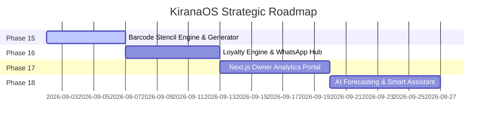

# KiranaOS — Phase-Wise Advanced Capabilities Roadmap (Phases 15 – 18)

**Document Version**: 2.0.0  
**Target Platform**: KiranaOS Flutter Mobile/Tablet, Next.js 15 Web Portal & Supabase Cloud  
**Status**: Ready for Execution  

---

## Roadmap Architecture Matrix

```
┌─────────────────────────────────────────────────────────────────────────────┐
│                             KIRANAOS PLATFORM                               │
├───────────────────────┬──────────────────────────┬──────────────────────────┤
│    Phase 15 (Hardware)│    Phase 16 (CRM/Receipt)│    Phase 17 (Web Portal) │
│  Barcode Stencils &   │  Customer Loyalty &      │  Executive Analytics &   │
│  Custom SKU Printing  │  WhatsApp Digital Hub    │  Multi-Store Owner Suite │
├───────────────────────┴──────────────────────────┴──────────────────────────┤
│                           Phase 18 (Intelligence)                           │
│              AI Sales Assistant & Kirana Stock Forecasting                  │
└─────────────────────────────────────────────────────────────────────────────┘
```

---

## Phase 15: Barcode Label Batch Generator & Thermal Stencils

### 1.1 Objective
Empower shopkeepers to generate, format, and print standard adhesive barcode labels for loose, unpackaged, or in-house bagged items (e.g., loose sugar, toor dal, custom spice blends) using mobile thermal label printers or desktop A4 sticker sheets.

### 1.2 Key Capabilities & Specifications
1. **Custom Internal SKU / In-Store EAN-13 Generator**:
   - Automatic generation of unique in-store EAN-13 codes with standard retail in-store prefix `20xxxx` to `29xxxx` with Luhn check-digit computation.
   - Support for weight-embedded variable barcode formats: `20 + 5-digit SKU + 5-digit Weight (grams) + Check Digit`.
2. **Multi-Format Label Stencils**:
   - **Roll Labels**: `50mm × 25mm`, `38mm × 25mm`, `58mm × 40mm`.
   - **Sheet Labels (A4)**: `24-up (3×8)`, `48-up (4×12)`, `65-up (5×13)` standard sticker sheets.
3. **Thermal ESC/POS & PDF Stencil Engine**:
   - Raster/Vector thermal printer commands with high contrast for quick scanner readability.
   - Batch queue: Print 50 copies of "Toor Dal 1kg @ ₹140.00" in one tap.

### 1.3 Database & Schema Extensions
```sql
-- apps/mobile Drift SQLite & Supabase migration
ALTER TABLE products ADD COLUMN internal_sku TEXT;
ALTER TABLE products ADD COLUMN is_loose_item BOOLEAN DEFAULT false;
ALTER TABLE products ADD COLUMN barcode_label_template TEXT DEFAULT 'roll_50x25';
```

---

## Phase 16: Customer Loyalty, Rewards & WhatsApp Digital Receipts

### 1.1 Objective
Enhance customer retention and digital engagement by issuing WhatsApp digital receipt links and managing a lightweight, offline-resilient customer loyalty rewards program.

### 1.2 Key Capabilities & Specifications
1. **WhatsApp Digital Receipts**:
   - Auto-generate clean, mobile-friendly PDF/Web invoice links and WhatsApp URL intent:
     `https://wa.me/91XXXXXXXXXX?text=...`
   - WhatsApp business API webhook integration for automated dispatch on bill completion.
2. **Loyalty Points Ledger**:
   - Configurable earn rates (e.g., 1 Point per ₹100 spent) and redemption conversion (e.g., 1 Point = ₹1.00 discount).
   - Real-time point balance lookup on POS billing customer selection.
   - Anti-fraud point expiration and transaction reversal on bill cancellation.
3. **Automated Khata/Udhaar Collection Reminders**:
   - One-tap WhatsApp payment reminder with dynamic UPI Payment Links (`upi://pay?pa=...&am=...&pn=...`).

### 1.3 Schema Additions
```sql
CREATE TABLE customer_loyalty_ledger (
    id UUID PRIMARY KEY DEFAULT gen_random_uuid(),
    shop_id UUID NOT NULL REFERENCES shops(id),
    customer_id UUID NOT NULL REFERENCES customers(id),
    bill_id UUID REFERENCES bills(id),
    points_earned INTEGER DEFAULT 0,
    points_redeemed INTEGER DEFAULT 0,
    balance_after INTEGER NOT NULL,
    created_at TIMESTAMPTZ DEFAULT now()
);
```

---

## Phase 17: Web Owner Portal & Executive Analytics Dashboard

### 1.1 Objective
Equip shop owners with a full-screen, deep-dive Next.js 15 analytics dashboard for managing multi-register stores, tracking net profit margins, and monitoring cashier audit logs.

### 1.2 Key Capabilities & Specifications
1. **Executive Financial Summary**:
   - Daily/Weekly/Monthly Gross Revenue, Cost of Goods Sold (COGS), Gross Profit, and Net Margin percentage.
   - Cash vs. UPI vs. Udhaar payment method distribution pie charts.
2. **Sales Velocity & Dead Stock Heatmap**:
   - Hourly billing velocity chart identifying peak rush hours.
   - Slow-moving/Dead stock alerts for inventory unmoved for >30/60/90 days.
3. **Cashier Performance & Shift Drawer Reconciliation**:
   - Cash drawer opening balance vs. closing tally reconciliation.
   - Cashier speed metric (average items scanned per minute) and discount override logs.
4. **GST Tax Liability Report**:
   - One-click GSTR-1 export format (B2B, B2C Large, B2C Small tables with HSN summary).

---

## Phase 18: AI Sales Assistant & Kirana Stock Forecasting

### 1.1 Objective
Provide micro-retailers with intelligent replenishment triggers, festival demand forecasting, and a natural language voice/chat assistant for inventory queries.

### 1.2 Key Capabilities & Specifications
1. **Intelligent Stock Replenishment Forecast**:
   - Heuristic + Exponential Smoothing algorithm: `Reorder Point = (Daily Sales Velocity × Supplier Lead Time) + Safety Stock`.
   - Automated purchase order generation for top suppliers when products breach safety threshold.
2. **Festive / Seasonal Demand Surge Predictions**:
   - Seasonal demand multipliers for festivals (Diwali, Eid, Holi, Navratri, Pongal) on high-demand categories (Sugar, Ghee, Dry Fruits, Atta).
3. **Slow-Moving Stock Bundle Recommendations**:
   - Identify dead stock items and suggest high-margin bundle pairings (e.g., "Pair slow-moving Basmati Rice brand with Sunflower Oil at 5% combo discount").
4. **Vernacular AI Store Assistant**:
   - Natural language queries in Hinglish, Hindi, and English (e.g., *"Aaj kitna toor dal bika?"* or *"Sugar stock kab khatam hoga?"*).

---

## Phase Rollout Timeline & Sequence


