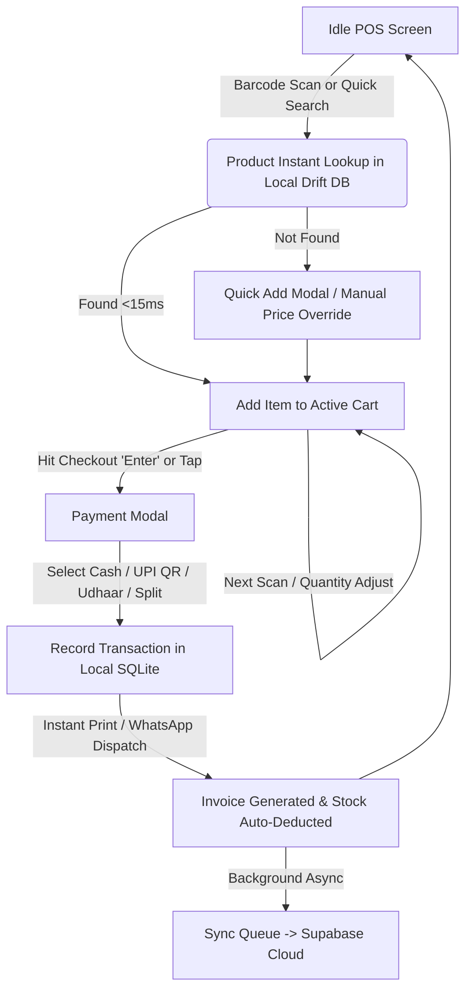

# Product Requirements Document (PRD) — KiranaOS

**Product Name**: KiranaOS  
**Target Market**: Indian Retail (Kirana, Provision, General Stores, Mini-Supermarkets, FMCG Outlets)  
**Document Version**: 1.0.0 (Phase 01 Production Architecture)  
**Status**: Approved Architecture Foundation  

---

## 1. Executive Summary & Problem Statement

### 1.1 The Kirana Landscape
Over 13 million traditional Kirana (mom-and-pop grocery) stores power ~90% of India's $800B+ retail food and grocery market. Despite rapid digital adoption in payments (UPI), these micro-retailers face severe operational bottlenecks:
1. **Unforgiving Checkout Speed Demands**: Peak evening rush hours (6 PM – 9 PM) allow no more than **2 to 5 seconds per item scanned and added to bill**. Any lag or cloud latency results in customer walkaways.
2. **Flaky Internet Connectivity**: Typical stores suffer intermittent 4G/5G drops, power outages, and poor basement cellular reception. Cloud-only POS systems break during critical billing windows.
3. **Complex Credit (Udhaar / Khata) Management**: 40–60% of recurring neighborhood purchases are done on credit. Paper notebooks lead to disputes, forgotten receivables, and working capital leakage.
4. **FMCG Dynamic Pricing & Packaging Variations**: Frequent MRP/purchase price updates, loose goods sold by weight (kg/grams vs. packaged EAN barcodes), and diverse GST tax slabs (0%, 5%, 12%, 18%, 28%).
5. **Staff Turnover & Usability**: Low-wage shop assistants with minimal tech literacy require intuitive, error-proof, touch-first or barcode-gun-first interactions in vernacular contexts.

### 1.2 The Solution: KiranaOS
KiranaOS is a production-grade, offline-first Point of Sale (POS) and Business Management System. It pairs a lightning-fast local SQLite/Drift database on Android mobile and tablet terminals with real-time cloud synchronization to PostgreSQL via Supabase, complemented by a Next.js web portal for deep analytics, supplier procurement, and multi-store administration.

---

## 2. Target User Personas

| Persona | Role | Key Needs & Pain Points | Primary Device |
| :--- | :--- | :--- | :--- |
| **Ramesh Gupta (52)** | Shop Owner / Proprietor | High-level profit/loss oversight, supplier payments, credit recovery alerts, staff theft prevention, GST filing summary. | Android Tablet & Next.js Web |
| **Sunil Verma (24)** | Lead Cashier / Billing Staff | 1-second barcode scan response, rapid loose-item search, instant UPI QR generation, thermal receipt printing, split payment handling. | Android Mobile / POS Tablet + Barcode Gun |
| **Pooja Sharma (28)** | Inventory & Procurement Manager | Low-stock alerts, purchase order creation, batch expiry tracking, barcode generation for unpackaged grains/pulses. | Next.js Web / Android Tablet |
| **Rajesh Kumar (35)** | Regular Neighborhood Customer | WhatsApp digital receipts, transparent Udhaar balance statements, quick item returns. | WhatsApp / SMS (Passive receiver) |

---

## 3. Product Vision & Core Workflows

### 3.1 Primary POS Billing Workflow (Zero-Lag Guarantee)

### 3.2 Key Functional Modules
1. **High-Speed Barcode Billing**:
   - Hardware USB/Bluetooth HID scanner support, physical keyboard shortcuts (`F1`–`F12`, `Enter`, `Esc`), and camera-based scanning via Google MLKit.
   - Offline item resolution in `<15ms`.
   - Park / Hold bill functionality (holding Customer A's cart while Customer B pays for milk).
2. **Product & Master Catalog Management**:
   - Dual barcode support (standard 13-digit EAN/UPC + internal custom SKU barcodes).
   - Loose product pricing (e.g., Sugar @ ₹44/kg -> enter 250g -> auto-compute ₹11.00).
   - Multi-image support (compressed WebP stored in Supabase Storage with local cached copies).
   - Multi-tier tax handling: CGST + SGST or IGST with HSN codes.
3. **Inventory & Batch Tracking**:
   - Real-time stock decrement on bill creation; auto-reversal on bill cancellation/returns.
   - Expiry date tracking for perishable goods (dairy, breads, packaged snacks).
   - Low-stock threshold triggers with push/in-app notifications.
4. **Udhaar / Credit (Khata) Subsystem**:
   - Customer credit balance tracking with safety credit limits.
   - One-tap WhatsApp payment reminder generation with embedded UPI payment link.
   - Partial payment settlement against specific historical credit bills or open ledger balances.
5. **Supplier Purchases & Inward Stocking**:
   - Supplier invoice ledger, payment tracking, and bulk stock inwarding with purchase price vs. selling MRP margin computation.
6. **Expense Tracking**:
   - Petty cash, electricity, rent, transport, tea/snacks, staff wage advances categorized and deducted from daily cash drawer totals.
7. **Comprehensive Reporting & Day-End Z-Report**:
   - Daily Cash Drawer reconciliation (Opening Cash + Cash Sales + Debt Recoveries - Expenses - Cash Drops = Closing Cash).
   - Gross Margin & Profit Analysis, Fast-Moving vs. Dead Stock reports, GST Sales & Inward reports.
8. **Shop Profile & Multi-Staff RBAC**:
   - Owner, Store Manager, Cashier roles with granular permissions (e.g., Cashiers cannot view profit margins or delete bills without Owner PIN).

---

## 4. Non-Functional Requirements (NFRs) & Performance SLAs

| Metric | Target SLA | Strategy |
| :--- | :--- | :--- |
| **Local Barcode Lookup Latency** | `< 15ms` | Indexed SQLite lookup on `product_barcodes(barcode)`. |
| **Cart Item Addition to Render** | `< 30ms` (60fps) | Unidirectional Riverpod state stream with micro-animation <=150ms. |
| **Complete Bill Finalization Latency** | `< 50ms` | Local ACID transaction in Drift; zero network blocking. |
| **Cold Startup Time** | `< 1.2 seconds` | Lazy database initialization and deferred background sync warmup. |
| **Memory Ceiling on Low-End Android** | `< 120MB RSS` | Optimized image caching, object recycling, no memory leaks. |
| **Crash-Free Sessions** | `> 99.95%` | Robust `Result<T>` functional error boundaries, zero uncaught async errors. |
| **Offline Retention** | Unlimited (Days/Weeks) | Durable local SQLite queue; auto-sync upon connectivity restoration. |

---

## 5. User Experience & Design Guardrails
1. **High Contrast POS Mode**: Crisp dark text on high-contrast backgrounds, large font sizes (18sp–24sp) for totals and prices, easily readable under bright store neon lights.
2. **One-Thumb Touch Targets**: Minimum interactive touch dimension of `48dp x 48dp` on mobile; generous grid buttons for numeric numpads.
3. **No Blocking Loading Spinners on POS**: Cashiers never wait for network spinners. Local write succeeds immediately with a subtle sync status badge (`🟢 Synced`, `🟡 Queued (3)`).
4. **Audio & Haptic Feedback**: Distinct acoustic tones for:
   - Successful barcode scan (crisp high beep).
   - Duplicate/Already added item (double click).
   - Item not found (low buzz + quick add sheet).
   - Payment success (celebratory chime).
