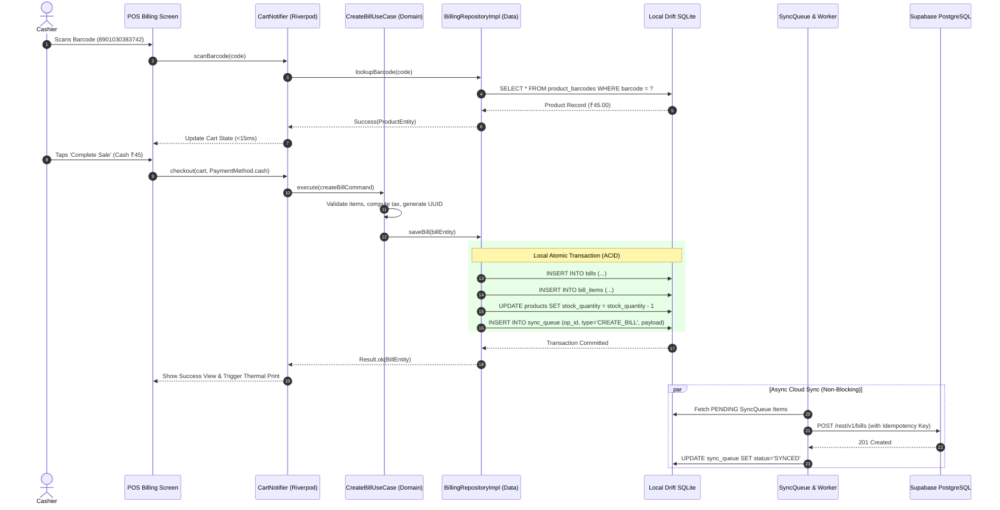

# Technical Requirements Document (TRD) — KiranaOS

**Document Version**: 1.0.0 (Phase 01 Production Architecture)  
**Target Runtime**: Flutter 3.41+ / Dart 3.11+, Next.js 15+ / React 19, Supabase (PostgreSQL 16)  
**Architectural Standard**: Clean Architecture + Feature-First (Mobile) & Layered App Router (Web)  

---

## 1. System Architecture & Topology

KiranaOS adopts a **Local-First, Cloud-Authoritative Distributed Topology**.

```
┌────────────────────────────────────────────────────────┐       ┌───────────────────────────────────────────────────────┐
│              FLUTTER CLIENT (Mobile/Tablet)            │       │               NEXT.JS WEB (Desktop Portal)            │
│                                                        │       │                                                       │
│  Presentation (Riverpod 2.x + GoRouter 14.x)           │       │  React Server Components + Client Data Grids          │
│       │                                                │       │       │                                               │
│  Domain (Pure Dart Entities & Use Cases)               │       │  Domain Actions & Server Validations                  │
│       │                                                │       │       │                                               │
│  Data Layer (Repositories + Sync Engine)               │       │  Supabase PostgREST Client + Direct SSR queries       │
│       │                                      │         │       └──────────────────────────┬────────────────────────────┘
│  Local SQLite (Drift ORM)             Supabase SDK     │                                  │
│  (Zero-latency POS Operations)        (Cloud Sync)     │                                  │
└──────────────────────────────────────────────┬─────────┘                                  │
                                               │                                            │
                                               ▼                                            ▼
                                 ┌─────────────────────────────────────────────────────────────┐
                                 │                 SUPABASE CLOUD INFRASTRUCTURE               │
                                 │                                                             │
                                 │   • PostgreSQL 16 (Authoritative Database + RLS Policies)   │
                                 │   • GoTrue Auth (JWT + Phone OTP + Email/Password)          │
                                 │   • Realtime Engine (Change Data Capture WebSockets)        │
                                 │   • Storage Buckets (Product Images with Edge CDN)          │
                                 │   • Edge Functions (WhatsApp API, PDF Receipt Generation)   │
                                 └─────────────────────────────────────────────────────────────┘
```

---

## 2. Core Technical Decisions & Justifications

### 2.1 Currency & Arithmetic Invariant (Zero Floating-Point Error Rule)
- **Problem**: IEEE 754 floating-point arithmetic introduces rounding inaccuracies (e.g. `0.1 + 0.2 = 0.30000000000000004`). In retail billing involving GST and fractional weights, this leads to financial discrepancies.
- **Decision**: All financial amounts in business logic, database tables, and network payloads MUST be stored as **`BIGINT` in Paise (1 INR = 100 Paise)**.
- **Conversion**:
  - ₹10.50 is stored as `1050`.
  - ₹1,250.75 is stored as `125075`.
  - User presentation converts integer paise to formatted currency string (e.g., `₹1,250.75`) only at the final display layer.

### 2.2 Local Persistence Engine: Drift (SQLite)
- **Why Drift?**
  - Compile-time SQL query type safety with Dart code generation.
  - Reactive streams (`watch()`) for instantaneous UI updates when data changes locally.
  - Native performance on Android/iOS/Desktop via `sqlite3_flutter_libs`.
  - Comprehensive migration framework with `MigrationStrategy`.
  - Offline-first transactional integrity (ACID) during billing.

### 2.3 State Management & Dependency Injection: Riverpod 2.x
- **Why Riverpod?**
  - Compile-time safety (eliminates `ProviderNotFoundException`).
  - Strict unidirectional data flow (`AsyncNotifier`, `Notifier`).
  - Granular auto-dispose and test isolation without Flutter context dependency.
  - Clean separation between UI State, Domain State, and Sync Status.

### 2.4 Navigation: GoRouter
- **Declarative routing** supporting path params (`/products/:id`, `/bills/:id`).
- **Auth & Role Guards** evaluating `authStateProvider` and redirecting unauthenticated users to `/auth` and unauthorized users to `/forbidden`.
- **Responsive Layout Support**: Shell routes with adaptive bottom navigation on mobile and persistent sidebar navigation on tablet/web.

### 2.5 Animation Subsystem: Purposeful & Lightweight
- Native Flutter motion APIs (`AnimatedSwitcher`, `FadeTransition`, `SlideTransition`, `Hero`).
- `flutter_animate` for declarative micro-interactions (max 280ms duration).
- `shimmer` for skeleton loading.
- Strict ban on particle effects, unbounded continuous animations, or heavy Lottie animations on transactional POS screens.

---

## 3. Technology Stack & Dependency Matrix

### 3.1 Mobile Client (`apps/mobile`)

| Domain | Library / Package | Version Constraint | Purpose |
| :--- | :--- | :--- | :--- |
| **Framework** | Flutter SDK | `>=3.24.0 <4.0.0` | Cross-platform UI runtime |
| **Language** | Dart SDK | `>=3.5.0 <4.0.0` | Strong-mode sound null-safety |
| **State Management** | `flutter_riverpod` | `^2.6.1` | Reactive state container |
| **Routing** | `go_router` | `^14.8.1` | Declarative routing & guards |
| **Local Database** | `drift`, `drift_flutter` | `^2.24.2` | Reactive SQLite persistence |
| **SQLite Binaries** | `sqlite3_flutter_libs` | `^0.5.28` | Native C SQLite3 bindings |
| **Cloud Backend** | `supabase_flutter` | `^2.8.4` | Auth, PostgREST, Realtime, Storage |
| **Secure Storage** | `flutter_secure_storage`| `^9.2.4` | Encrypted token & PIN storage |
| **Network Monitor** | `connectivity_plus` | `^6.1.3` | Real-time cellular/WiFi monitor |
| **Utilities** | `uuid`, `intl` | `^4.5.1`, `^0.20.2`| ID generation & INR formatting |
| **Micro-Animations** | `flutter_animate` | `^4.5.2` | Bounded micro-interactions |
| **Loading Skeletons**| `shimmer` | `^3.0.0` | List & card loading placeholders |
| **Code Generation** | `freezed`, `json_serializable` | `^2.5.7`, `^6.9.4` | Immutable models & JSON serialization |

### 3.2 Web Back-Office (`apps/web`)

| Domain | Library / Package | Version Constraint | Purpose |
| :--- | :--- | :--- | :--- |
| **Framework** | Next.js (App Router) | `^15.1.0` | React Server Components & SSR |
| **UI Library** | React | `^19.0.0` | Component framework |
| **Styling** | Tailwind CSS | `^3.4.17` | Utility-first design tokens |
| **Icons** | `lucide-react` | `^0.475.0` | Consistent vector iconography |
| **Backend Client** | `@supabase/ssr`, `@supabase/supabase-js` | `^0.5.2`, `^2.49.1` | Server/client cloud integration |
| **Data Tables** | `@tanstack/react-table` | `^8.21.2` | High-performance inventory grids |

---

## 4. Architectural Boundaries & Data Flow Rules



---

## 5. Non-Negotiable Engineering Rules
1. **Rule 1 — Zero UI Business Logic**: Widgets only render state and trigger events. No arithmetic, price multipliers, or tax computations inside `build()` methods.
2. **Rule 2 — Single Source of Local Truth**: All UI reads flow from local Drift DB streams or Riverpod caches. The UI NEVER directly awaits HTTP/Supabase queries during checkout.
3. **Rule 3 — Idempotent Network Operations**: Every mutative sync operation carries a client-generated UUID `operation_id` to guarantee zero duplicate bills on retries.
4. **Rule 4 — Soft Deletion of Financial Records**: Bills, credit entries, and payments are NEVER hard-deleted. They use `is_cancelled = true` with audit timestamps and user attribution.
5. **Rule 5 — Strict Layer Imports**: Domain cannot import Data or Presentation. Data cannot import Presentation. Presentation cannot import Drift tables directly.
