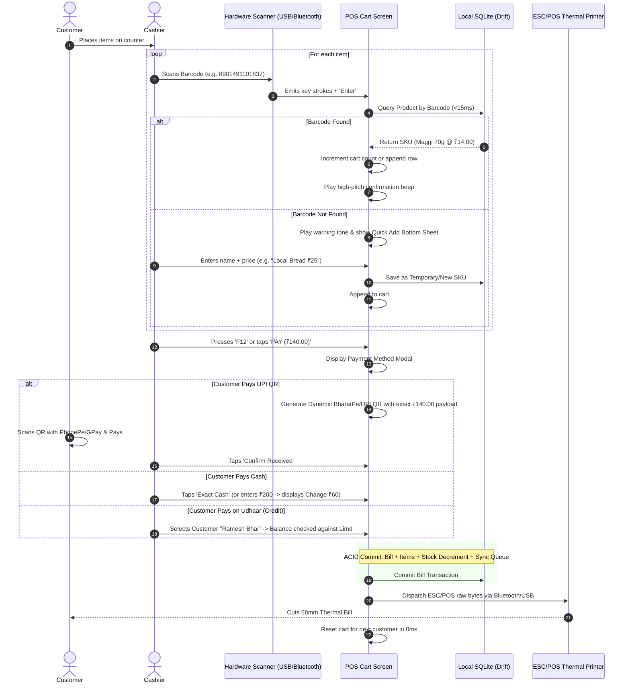
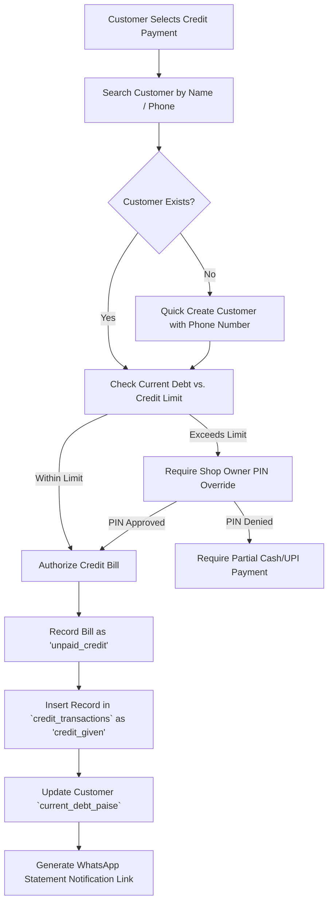

# Core Business Workflows — KiranaOS

**Document Version**: 1.0.0 (Phase 01 Production Architecture)  

---

## 1. Fast Barcode Billing Workflow (Sub-50ms Transaction)

---

## 2. Udhaar (Khata / Credit) Ledger Workflow

### Udhaar Debt Recovery Process:
1. Shopkeeper opens `/credit` or customer detail `/customers/:id`.
2. Taps **"Receive Payment"** -> Enters amount collected (e.g., ₹500 against ₹1,200 total debt).
3. Selects receiving mode (**Cash** or **UPI**).
4. System records `credit_transactions` row (`payment_received`), decrements `current_debt_paise`.
5. Auto-generates WhatsApp confirmation message:
   > *"Namaste Ramesh Bhai, received ₹500.00 at Gupta General Store. Your updated balance is ₹700.00. Thank you!"*

---

## 3. Loose Goods & Fractional Weight Pricing Workflow

For unpackaged commodities (e.g. Rice, Sugar, Dals, Oil):
- **Pricing by Base Unit**: Configured as ₹48.00 / 1 kg (Paise: `4800` per `1.000` kg).
- **Cart Entry**:
  - Cashier enters weight in grams (e.g., `350g` = `0.350` kg).
  - Formula: `Total Paise = (Base Price Paise * Quantity Milligrams) / 1000000`.
  - Rounded to nearest integer paise: `(4800 * 350000) / 1000000 = 1680 Paise = ₹16.80`.

---

## 4. Day-End Cash Drawer Reconciliation (Z-Report)

At the end of each business day:
1. **Opening Float Balance**: Cash in drawer at start of day (e.g. ₹2,000.00).
2. **Cash Inflows**:
   - Total Cash Sales (e.g. ₹18,450.00).
   - Cash Debt Recoveries (e.g. ₹3,200.00).
3. **Cash Outflows**:
   - Daily Cash Expenses (Tea, Transport, Supplier cash payouts) (e.g. ₹1,150.00).
   - Cash Vendor Advances (e.g. ₹2,000.00).
4. **Calculated Closing Cash**:
   $$\text{Expected Cash} = \text{Opening} + \text{Cash Sales} + \text{Recoveries} - \text{Expenses} - \text{Inward Outflows}$$
   $$\text{Expected} = 2000 + 18450 + 3200 - 1150 - 2000 = ₹20,500.00$$
5. **Physical Count Entry**: Cashier enters actual currency note denominations (e.g., $10 \times ₹500$, $40 \times ₹200$, etc.).
6. **Variance Calculation**: $\text{Variance} = \text{Actual Count} - \text{Expected}$.
7. **Z-Report Generated & Locked**: Snapshot saved and synced to owner dashboard.
